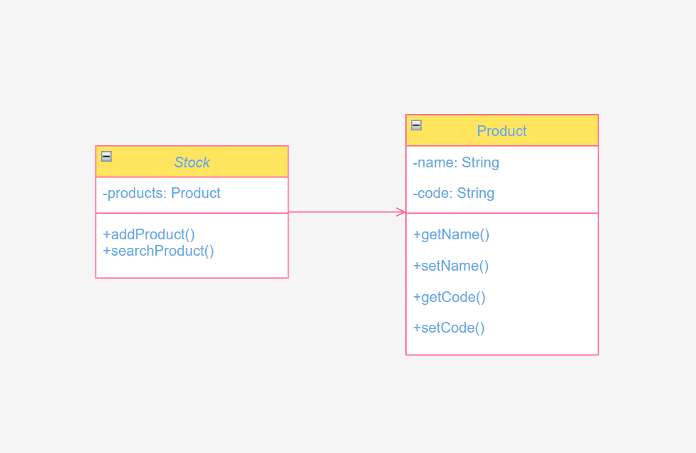

# Atividade 1 
## Software Engineering at Google, Oreilly 

**Trecho 1**
>What precisely do we mean by software engineering? What distinguishes “software engineering” from “programming” or “computer science”? And why would Google have a unique perspective to add to the corpus of previous software engineering literature written over the past 50 years?
 >
>The terms “programming” and “software engineering” have been used interchangeably for quite some time in our industry, although each term has a different emphasis and different implications. University students tend to study computer science and get jobs writing code as “programmers.”
>
>“Software engineering,” however, sounds more serious, as if it implies the application of some theoretical knowledge to build something real and precise. Mechanical engineers, civil engineers, aeronautical engineers, and those in other engineering disciplines all practice engineering. They all work in the real world and use the application of their theoretical knowledge to create something real. Software engineers also create “something real,” though it is less tangible than the things other engineers create.
 >
>Unlike those more established engineering professions, current software engineering theory or practice is not nearly as rigorous. Aeronautical engineers must follow rigid guidelines and practices, because errors in their calculations can cause real damage; programming, on the whole, has traditionally not followed such rigorous practices. But, as software becomes more integrated into our lives, we must adopt and rely on more rigorous engineering methods. We hope this book helps others see a path toward more reliable software practices.

**Comentário:** Com esse trecho do livro Software Engineering at Google, podemos ter uma noção introdutória do que é um engenheiro de software, e percebemos que se diferencia da profissão de "programador". O engenheiro de software, assim como outros profissões da área da engenharia, criam coisas reais utilizando da aplicação de seus conhecimentos teóricos. Diferentemente de outros campos da engenharia, a de software não segue padrões tão rigorosos, mas com aproximação dos softwares a nossa vida cotidiana vemos que é necessário que adotemos metódos mais rigorosos.
# Atividade 2
## Software Engineering at Google, Oreilly
**Trecho 2**

>Programming Over Time
>We propose that “software engineering” encompasses not just the act of writing code, but all of the tools and processes an organization uses to build and maintain that code over time. What practices can a software organization introduce that will best keep its code valuable over the long term? How can engineers make a codebase more sustainable and the software engineering discipline itself more rigorous? We don’t have fundamental answers to these questions, but we hope that Google’s collective experience over the past two decades illuminates possible paths toward finding those answers.
> 
>One key insight we share in this book is that software engineering can be thought of as “programming integrated over time.” What practices can we introduce to our code to make it sustainable—able to react to necessary change—over its life cycle, from conception to introduction to maintenance to deprecation?
>
>The book emphasizes three fundamental principles that we feel software organizations should keep in mind when designing, architecting, and writing their code:
> 
>Time and Change
>How code will need to adapt over the length of its life
 >
>Scale and Growth
>How an organization will need to adapt as it evolves
> 
>Trade-offs and Costs
>How an organization makes decisions, based on the lessons of Time and Change and Scale and Growth

**Comentário:** Assim como no texto anterior, são levantadas questões sobre como engenheiros de software podem manter uma base de código mais sólida com práticas mais consistentes e estritas? 
Afirma-se que a engenharia de software engloba não somente a prática escrever códigos, mas todas as ferramentas que uma organização pode usar para construir e manter o código com o tempo. Então são levantados três pontos fundamentais para se ter em mente ao construir um código e estruturá-lo: 
- Tempo e Mudança
- Escalamento e Crescimento
- *Trade-offs*(compensação) e Custos

# Atividade 3
## 3 exemplos Trade-off
- Desempenho vs. Manutenibilidade

Exemplo: Um banco de dados pode ser otimizado para consultas extremamente rápidas através do uso de índices complexos e armazenamento em cache. No entanto, isso pode tornar o código e a estrutura do banco de dados mais difíceis de modificar no futuro, dificultando a manutenção e a escalabilidade do sistema

- Velocidade de Desenvolvimento vs. Qualidade do Código

Exemplo: É comum utilizar bibliotecas prontas para acelerar o lançamento do produto (como usar um gerador de código ou templates prontos). No entanto, essa abordagem pode resultar em um código menos eficiente e mais difícil de manter no longo prazo, exigindo refatoração futura.

- Sustentabilidade vs. Desempenho:

Exemplo: Uma empresa de tecnologia pode escolher reduzir o consumo de energia de seus servidores limitando a quantidade de processamento disponível para cada requisição. Isso torna a infraestrutura mais sustentável e ecológica, mas pode impactar negativamente o desempenho do sistema, resultando em tempos de resposta mais longos para os usuários.
# Atividade 4
## Diagrama UML
 

# Atividade 5

https://github.com/vp-p/bertoti/tree/main/engenhariadesoftware/Aula/src

# Atividade 6
https://github.com/vp-p/bertoti/tree/main/engenhariadesoftware/Aula/src

Usando a linguagem de programação Java, foram criados dois testes: um para chechar se os produtos foram adicionados a lista do estoque corretamentes e outro para certificar que a busca pelo produto, feita a partir do nome, havia buscado o produto correto, checando seu código.

